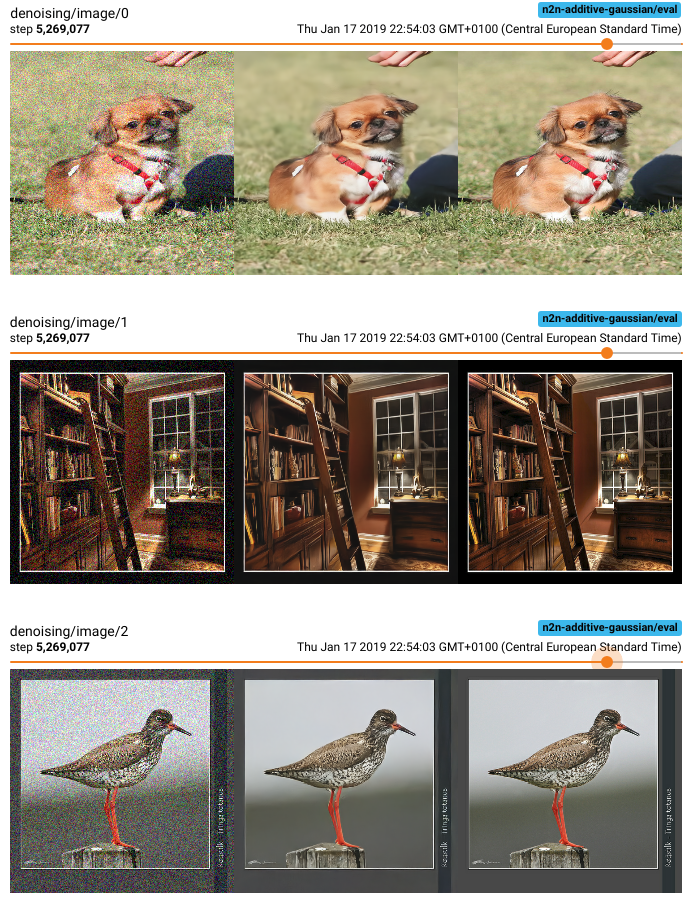
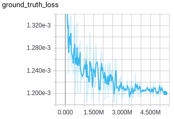
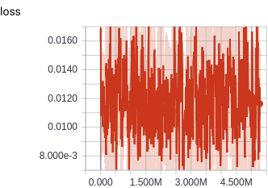
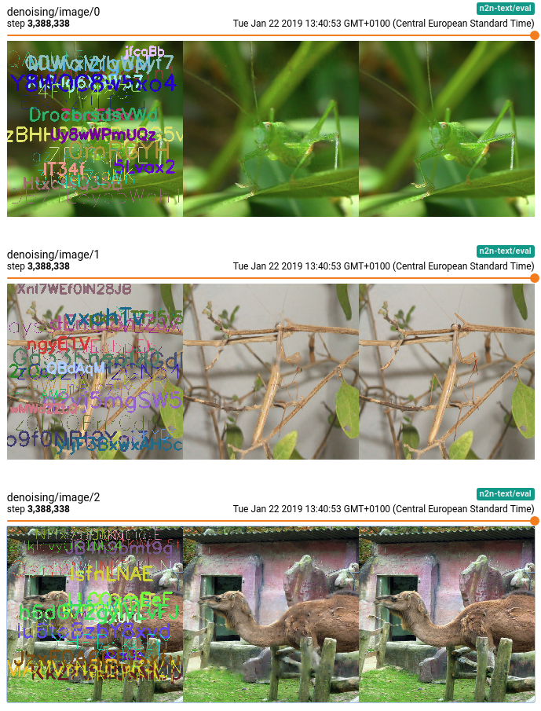

# Noise2Noise
Tensorflow [Noise2Noise](https://arxiv.org/abs/1803.04189) implementation.

Noise2Noise is a machine learning algorithm that can learn signal reconstruction from only
noisy examples, i.e. both inputs and targets are noisy realisations of the same image.

## Prerequisites
* Tfrecord files with jpeg encoded images under key `image/encoded` for training and evaluation.

## Docker
(requires [nvidia-docker](https://github.com/NVIDIA/nvidia-docker))

Build docker image
```bash
$ docker build -t n2n .
```

Run a command inside docker container
```bash
$ ./scripts/run-in-docker <command>
```

Mount extra volumes for input or output reasons. Current directory is already shared.
```bash
$ VOLUMES="/vol1:/vol1 /vol2:/vol2" ./scripts/run-in-docker <command>
```

## Help
```bash
$ python -m n2n.train --helpfull
```

## Results
Images from left to right are input image, denoised image, and ground truth noise free image.

### Additive gaussian noise
```bash
$ python -m n2n.train <required-args> --noise additive_gaussian --loss l2
```


 

### Text overlay noise
```bash
$ python -m n2n.train <required-args> --noise text --loss l1
```


### Impulse noise
```bash
$ python -m n2n.train <required-args> --noise impulse --loss l0
```

### Bernoulli noise
TODO

### Poisson noise
TODO

## TODO
* Raytracing/raycasting noise?

