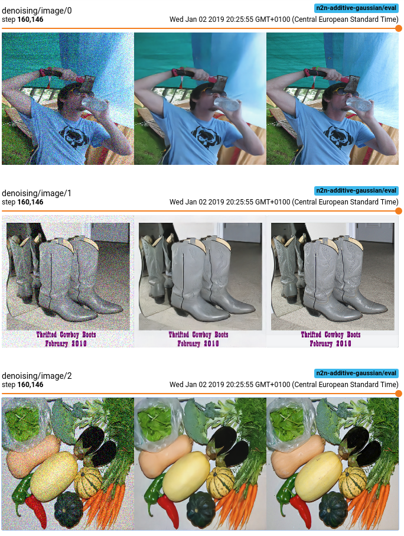

# Noise2Noise
Tensorflow [Noise2Noise](https://arxiv.org/abs/1803.04189) implementation.

Noise2Noise is a machine learning algorithm that can learn signal reconstruction from only
noisy examples, i.e. both inputs and targets are noisy realisations of the same image.

## Prerequisites
* Tfrecord files with jpeg encoded images under key `image/encoded` for training and evaluation.

## Docker
(requires [nvidia-docker](https://github.com/NVIDIA/nvidia-docker))

* `docker build -t n2n .`
* `./scripts/run-in-docker <command>`
* Extra volumes can be mounted by `VOLUMES="/vol1:/vol1 /vol2:/vol2" ./scripts/run-in-docker <command>`

## Help
```bash
$ python -m n2n.train --helpfull
```

## Results
```bash
$ python -m n2n.train <required-args> --noise additive_gaussian --loss l2
```


```bash
$ python -m n2n.train <required-args> --noise text --loss l1
```
TODO


